```markdown
<p align="center">
  
</p>

<h1 align="center">
  <span style="font-family: Georgia, serif; font-style: italic; color: #FF3E80;">🤖</span>
  <span style="font-family: Georgia, serif; font-style: italic; background: linear-gradient(45deg, #FF3E80, #FFD166, #2E86C1); -webkit-background-clip: text; -webkit-text-fill-color: transparent;">SADNESS-MD</span>
  <br>
  <small style="font-family: Georgia, serif; font-style: italic; color: #FFD166; font-size: 1.5rem;">L'Évolution Ultime des Bots WhatsApp</small>
</h1>

<p align="center">
  
  
  
  
</p>

<div align="center">
  
  
  
</div>

---

## ✨ **Caractéristiques Époustouflantes**

<table align="center">
  <tr>
    <td align="center" width="25%">
      
      <br>
      <sub><em><span style="font-family: Georgia, serif; font-style: italic;">Réponse en 0.2s</span></em></sub>
    </td>
    <td align="center" width="25%">
      
      <br>
      <sub><em><span style="font-family: Georgia, serif; font-style: italic;">Interface Élégante</span></em></sub>
    </td>
    <td align="center" width="25%">
      
      <br>
      <sub><em><span style="font-family: Georgia, serif; font-style: italic;">Protection Maximale</span></em></sub>
    </td>
    <td align="center" width="25%">
      
      <br>
      <sub><em><span style="font-family: Georgia, serif; font-style: italic;">Déploiement 3min</span></em></sub>
    </td>
  </tr>
</table>

---

## 🎯 **Pourquoi SADNESS-MD ?**

> <span style="font-family: Georgia, serif; font-style: italic; color: #FFD166;">"La fusion parfaite entre puissance brute et élégance numérique"</span>

<table>
  <tr>
    <td width="60%">
      <h3 style="font-family: Georgia, serif; font-style: italic; color: #FF3E80;">💫 Innovation Radicale</h3>
      <ul>
        <li>🎯 <strong>Session en ligne révolutionnaire</strong> - Plus de scan QR local</li>
        <li>⚡ <strong>Performance optimisée 300%</strong> - Plus rapide que jamais</li>
        <li>🔄 <strong>Mises à jour automatiques</strong> - Toujours à la pointe</li>
        <li>🌙 <strong>Mode sombre natif</strong> - Confort visuel optimal</li>
      </ul>
    </td>
    <td width="40%" align="center">
      
      <br><br>
      
    </td>
  </tr>
</table>

---

## 🚀 **Démarrage Express - 3 Minutes Chrono !**

### **Étape 1 : Générer la Session Magique ✨**

<p align="center">
  <a href="https://sadness-session-id.vercel.app" target="_blank">
    
  </a>
  <br>
  <em><span style="font-family: Georgia, serif; font-style: italic;">Pair Code • QR Code • Sécurisé • Instantané</span></em>
</p>

### **Étape 2 : Déploiement Céleste ☁️**

<p align="center">
  <a href="https://dashboard.katabump.com/auth/login#483bf6" target="_blank">
    
  </a>
</p>

<table align="center">
  <tr>
    <td align="center">✨ <strong>Serveur Gratuit</strong></td>
    <td align="center">⚡ <strong>Node.js Natif</strong></td>
    <td align="center">🛡️ <strong>Auto-Scaling</strong></td>
    <td align="center">🔧 <strong>24/7 Monitoring</strong></td>
  </tr>
  <tr>
    <td align="center"><em>Performant & Illimité</em></td>
    <td align="center"><em>Optimisé Bots</em></td>
    <td align="center"><em>Adaptatif</em></td>
    <td align="center"><em>Stabilité Garantie</em></td>
  </tr>
</table>

---

## 🏗️ **Architecture Technologique**

```mermaid
graph LR
    A[📱 WhatsApp Web] --> B[⚡ Baileys MD]
    B --> C[🚀 Node.js 18+]
    C --> D[💾 MongoDB/Redis]
    C --> E[🌐 Express API]
    E --> F[🎨 Interface Web]
    F --> G[📊 Dashboard Admin]
    
    style A fill:#25D366
    style B fill:#FF3E80
    style C fill:#339933
    style D fill:#47A248
    style E fill:#000000
    style F fill:#2E86C1
    style G fill:#FFD166
```

<div align="center">
  


</div>

Stack Technique Élite

<p align="center">
  
  
  
  
  
  
</p>

---

📊 Fonctionnalités Avancées

<details>
<summary><strong>🎭 <span style="font-family: Georgia, serif; font-style: italic;">Voir toutes les fonctionnalités magiques</span></strong></summary>

🤖 Intelligence Artificielle

· 🧠 GPT-4 Integration - Conversations naturelles
· 🎯 Auto-Learning - S'adapte à votre style
· 📚 Base de Connaissances - Mémoire persistante

🛡️ Sécurité Renforcée

· 🔐 Chiffrement E2E - Messages protégés
· 🚫 Anti-Spam - Détection intelligente
· 👁️ Logs d'Activité - Surveillance complète

🎨 Personnalisation

· 🎨 Thèmes Dynamiques - Changez l'apparence
· ⚙️ Plugins Modulaires - Extensions faciles
· 📱 Interface Responsive - Mobile & Desktop

⚡ Performance

· 🚀 Cache Multi-niveau - Rapidité extrême
· 🔄 Load Balancing - Distribution intelligente
· 💾 Optimisation Mémoire - Usage minimal

</details>

---

🌐 Communauté Vibrante

<p align="center">
  <a href="https://whatsapp.com/channel/0029VbCMzVZKWEKvtoE9Jk43" target="_blank">
    
  </a>
  <a href="https://t.me/kurona_tech_channel" target="_blank">
    
  </a>
  <a href="https://discord.gg/example" target="_blank">
    
  </a>
</p>

<table align="center">
  <tr>
    <td align="center">🎁 <strong>Codes Promo</strong></td>
    <td align="center">💡 <strong>Tutoriels</strong></td>
    <td align="center">🚀 <strong>Updates</strong></td>
    <td align="center">🤝 <strong>Support</strong></td>
  </tr>
  <tr>
    <td align="center"><em>Offres exclusives</em></td>
    <td align="center"><em>Guides détaillés</em></td>
    <td align="center"><em>En avant-première</em></td>
    <td align="center"><em>24/7 réactif</em></td>
  </tr>
</table>

---

⚠️ Avertissement Légal

<span style="font-family: Georgia, serif; font-style: italic; color: #FF6B8B;">Important : Ce projet est à but éducatif uniquement.</span>

<div align="center">

❗ Obligation 📜 Règle ⚖️ Conséquence
Respect Conditions WhatsApp Suspension possible
Usage Éducatif uniquement Responsabilité utilisateur
Éthique Bonne foi Nécessaire

</div>

<p align="center">
  <em>L'auteur décline toute responsabilité concernant une mauvaise utilisation.</em>
</p>

---

👑 Créateur Visionnaire

<p align="center">
  <strong style="font-family: Georgia, serif; font-style: italic; font-size: 1.5rem; color: #FFD166;">CRAZY KLEIN TECH</strong>
  <br>
  <em>Architecte de l'Innovation • Pionnier des Bots Next-Gen</em>
</p>

<div align="center">
  <a href="https://github.com/yourusername" target="_blank">
    
  </a>
  <a href="https://t.me/kurona_tech_channel" target="_blank">
    
  </a>
  <a href="https://twitter.com/yourprofile" target="_blank">
    
  </a>
</div>
